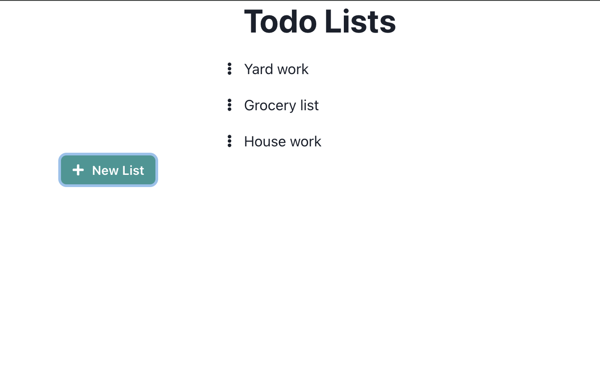
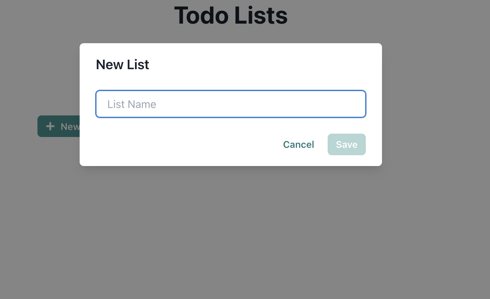
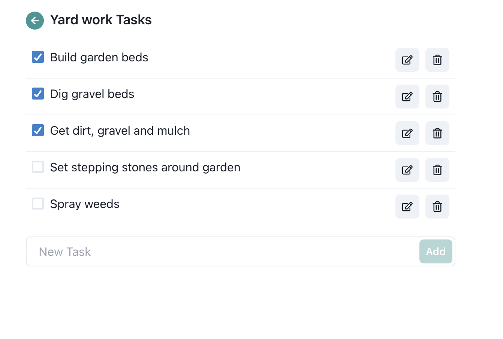
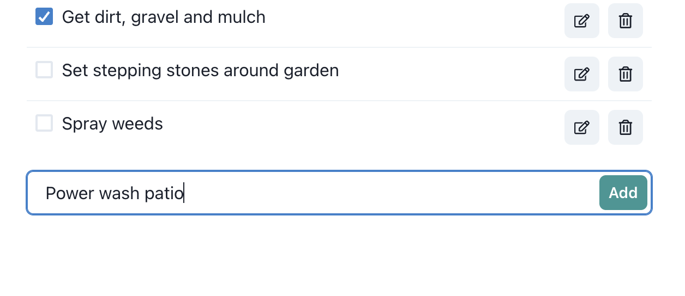

# todo-list
App to create and update todo lists

### Built with MERN stack
- MongoDB
- Express
- React running on Vite
- Node

### Screenshots
Main Lists Page

Create a new list

Tasks for a todo list

Add a new task

